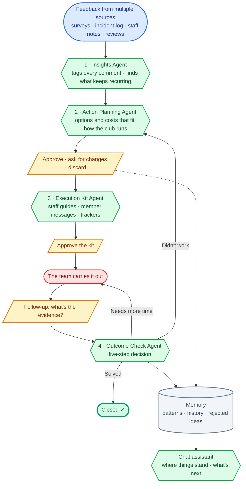

# Pala

Pala is a multi-agent system that helps a padel club act on member feedback, so members get the experience they deserve and keep coming back. It brings together feedback from multiple sources, picks out the recurring problems, and follows each one through until it's solved or needs a new approach, with people approving every step.

🌐 [Try it live](https://clubpadel-experiencia.streamlit.app/) (access on request) · 🏗️ [Full architecture](docs/architecture.md)

Built with Python · LangGraph · Gemini 3.7 Flash · Supabase · Streamlit

---

## Four agents, one loop



<sub>🔵 feedback · 🟢 AI agents · 🟡 human decisions · 🔴 real-world action · ⚪ memory</sub>

**Why four agents instead of one?** The four jobs happen at different times and need different things: Insights runs every week across all the feedback, Action Planning and Execution Kit work on one problem at a time, and Outcome Check only runs weeks later. Splitting them creates natural points where people approve before anything moves on, and it means the agent that judges a fix is never the one that proposed it. They pass work to each other through a shared memory that lasts across weeks, and when a fix doesn't work, Outcome Check sends the case back to Action Planning with everything already tried, so the next plan doesn't repeat it.

| Agent | What it does |
|---|---|
| **Insights** | Labels each comment by topic, complaint or praise, and safety risk. When the same problem shows up on different days or from different sources, it becomes a pattern, ranked by priority and linked to the comments behind it |
| **Action Planning** | Proposes how to fix a pattern, with options and costs, based on how the club runs: its operating procedures, rules, staff shifts, budget and season |
| **Execution Kit** | Turns the approved plan into ready-to-use material, each piece with an owner, a deadline and a success check |
| **Outcome Check** | Reviews the submitted evidence in five steps and decides if the case is: CLOSE (resolved), CONTINUE (it is still early), PIVOT (it didn't work and proposes a different approach), or FLAG (pending execution). |

A built-in **Chat Assistant** handles live-data queries directly, saving managers from navigating through every page. Managers can quickly ask about the padel club's health, next steps, or meeting prep to identify flags instantly. The system also delivers a weekly status update via Telegram.

## Tested on a padel club

To test Pala on realistic data, I modelled an independent padel club in Madrid: a post-match survey, a reception incident log, staff notes and Google reviews, plus staff shifts, spending limits and seasons. The club data is simulated, and the club isn't named.

These results come from weeks 1–4. Week 5 was added only to record the end-to-end demo.

| | |
|---|---|
| Recurring problems found | 8, no duplicates |
| Comment tagging (77 entries × 3 runs) | Every complaint found, none invented, identical labels every run |
| Follow-up decisions | 5/5 correct, and 30/30 on the evaluation set (10 cases × 3 runs) |
| Kits approved | 5/5, after at most one round of changes |
| Kit rules followed (evaluation set) | 94% |
| Cost per chat question | ~$0.01 |
| Running cost | A few euros a month in Gemini; everything else on free tiers |

## Impact

The results above show that the agents work correctly. The **Historial e impacto** page answers the next question: are their fixes helping the club? Its numbers come from what the system already records.

| Indicator | What it shows | Demo data (weeks 1–5) |
|---|---|---|
| Time to resolution | Weeks from detection to closing | 3 weeks |
| Fixes that worked | Cases closed with the first plan | 2 of 2 |
| Complaint change | Complaints after the fix vs the same weeks before | 3 → 1 where fixed; 9 → 10 where still open |
| Member satisfaction | Positive survey answers, week by week | 75% in week 5 |

For every closed case, the page also checks the proof behind it: was the fix confirmed, did the club see a result, did complaints go down, and have new ones stopped. It also compares fixed problems with those still open, so the club can tell whether an improvement comes from the fixes or just from a quieter few weeks.

With only two closed cases, this is a first signal. Recurrence over 90 days and the effect on real members need a [pilot](docs/pilot-plan.md).

**Beyond padel:** the same loop could apply to other businesses built on memberships and repeat visits, such as gyms, sports clubs, coworking spaces and language schools.

## Reliability and security

Every Gemini call goes through one gateway that retries on failure and logs time, tokens and cost. The app uses Google login with separate owner and manager permissions, the database is locked down with Row Level Security, and no secrets live in the code.

## Try it

Access to the live app is by request. Message me on [LinkedIn]( https://www.linkedin.com/in/christen-pena-7738271a0) with your Google email and I'll give you temporary access. It's a shared demo, so if something looks out of place, someone may have been there before you.

Start on **Detectar** to see this week's patterns, generate a recommendation, approve it or ask for a change, and see the kit it produces. **Seguir** shows how follow-ups are judged, **Historial e impacto** brings it all together, and the chat assistant answers anything along the way. The interface is in Spanish, and your browser's translate feature works well.

## Documentation

| Doc | What's in it |
|---|---|
| [Architecture](docs/architecture.md) | The full system diagram, and where people step in |
| [Pattern rules](docs/insights-pattern-rules.md) | When feedback becomes a pattern, and how urgent it is |
| [Testing and iteration log](docs/agent-testing-iteration-log.md) | Every version of every agent, and why it changed |
| [Evaluation set](eval/README.md) | Fixed test cases for accuracy and consistency |
| [Simulation assumptions](data/SIMULATION_ASSUMPTIONS.md) | How the test data was built, and what it means |
| [Pilot plan](docs/pilot-plan.md) | What it would take to run Pala at a real club |

## Project structure

```
agents/      the four agents, the chat assistant, the two LangGraph workflows, the model gateway and the impact calculations
evidence/    loading, tagging and the rules engine that decides what becomes a pattern
pages/       the app pages: new patterns, execution kits, follow-ups, and history and impact
data/        five weeks of simulated feedback, the club profile and the reference library
eval/        evaluation cases and results
docs/        architecture, pattern rules, iteration log and pilot plan
scripts/     the weekly run, the evaluation and the data generator
sql/         database setup and security policies
tests/       tests for the rules engine
```

