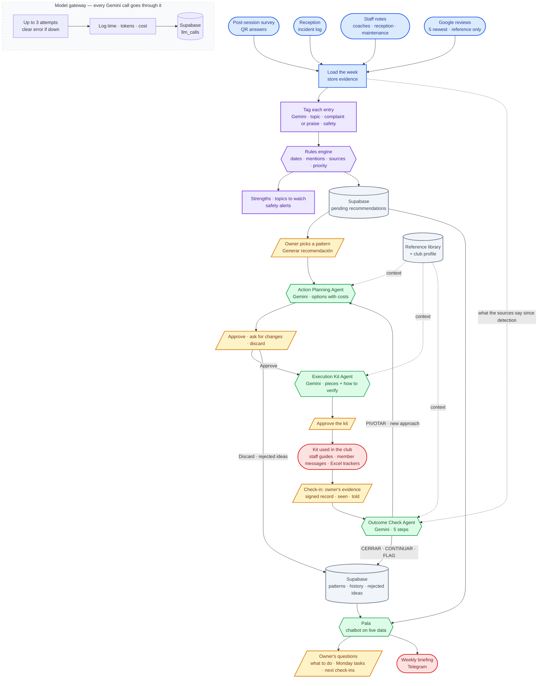

# Member Experience Multi-Agent System — System Architecture

How the pieces fit together, and where the owner has to step in before anything changes at the club.

**Legend:** blue shows the feedback coming in, purple shows how problems are detected, and green shows where Gemini reasons. Grey cylinders are where data is stored, yellow marks the owner's decisions, and red shows what reaches the real world: the club and the owner's phone.

## What each piece actually does

**Feedback sources** *(blue)* — The system reads four sources once a week: the survey members answer after playing, the reception incident log, staff notes, and Google reviews. Google is read the same way its official API returns it, with only the 5 newest reviews. The system stores a reference to each review (its id and date) but never the text, as Google's terms require. In this project, the club's own sources are simulated from written assumptions, documented in `data/SIMULATION_ASSUMPTIONS.md`.

**Detection** *(purple)* — Gemini reads each entry and labels its topic, whether it's a complaint or praise, and whether it suggests a safety risk. It also notes the specific place or item mentioned, such as a court number, so the system can tell when several complaints point to the same spot. A rules engine then decides what counts as a pattern. A topic qualifies when it's mentioned on at least 2 different days, and either 3 times or by 2 different sources, within the last 28 days. The same rules set each pattern's priority and list the club's strengths, topics to watch and safety alerts. New patterns are saved in Supabase and wait there until the owner opens them. The full rules are in [`insights-pattern-rules.md`](insights-pattern-rules.md).

**Reasoning** *(green)* — Four Gemini agents share the work, and each one has a single job:

1. **Action Planning** turns a pattern into a recommendation. It explains the problem, offers options with their costs, and says why the fix matters. It also receives the ideas the owner has already rejected, so it never suggests them again.
2. **Execution Kit** turns an approved plan into material the team can use right away, such as staff guides, member messages and Excel trackers. It names who is responsible, sets a deadline, and defines how to check that the fix worked. Before answering, it reviews its own draft against staff shifts, the effort asked of members, and seasonal limits.
3. **Outcome Check** decides whether to close the pattern, continue, try a different approach, or flag that the work hasn't been confirmed. It reasons in five visible steps: whether the work was done, whether enough time has passed, what success should look like, what the evidence shows, and the final decision. It also takes seasonal effects into account, so a problem that fades with the weather isn't mistaken for a fix.
4. **Pala** is a chatbot that answers from the system's own data. The owner can ask it what to do next, which tasks to bring to Monday's team meeting, or what happened with a pattern. Pala also writes the weekly briefing. It only reads data, and never approves or changes anything.

Every agent that writes follows a club profile, which describes staff shifts, spending limits, the club's channels and the tone to use. The agents can also cite a small reference library. Both are stored in `data/rag_library/`.

**Owner decisions** *(yellow)* — Nothing reaches the club without the owner's approval. Every plan and every kit can be approved, revised or discarded, and every follow-up starts with the owner's own evidence. Rejected and postponed ideas are saved together with the owner's reason.

**Real-world effects** *(red)* — The club's staff carry out the approved kit, and the weekly briefing is sent to the owner's phone. The demo uses Telegram, and WhatsApp is already supported in the code for a real deployment.

**Model gateway** *(dashed box)* — Every call to Gemini goes through one file, `agents/llm.py`. If Gemini is busy, the call is retried up to 3 times, and if it still fails, the owner sees a clear message instead of an error. Each call is logged with its duration, size and cost.

**Around the system** — The app is protected by Google login, and an access matrix defines what the owner and the manager can each do. The owner can also preview the app exactly as the manager sees it. The database is closed to outside access, secret keys never go into the code repository, and the app runs online on Streamlit Community Cloud. LangGraph connects all the steps and pauses the workflow at every owner decision.

## One decision worth calling out

**The rules decide what counts as a problem, not the model.** Gemini is good at reading messy text, but its judgement can change from one run to the next, and it can't show an owner exactly why something became a pattern. For that reason, Gemini only labels the entries, and a rules engine with 14 automated tests makes the decision the same way every time. As a result, every pattern can be traced back to the exact entries, dates and sources behind it.

The evaluation in `eval/` confirms that this split works. Across 77 entries, each labelled three times, Gemini found every complaint, invented none, and produced the same labels in every run.

## Human in the loop: the owner decides

The system is built with a human in the loop, which means the agents prepare the work and the owner approves it before anything happens at the club. The owner steps in at three points: approving each recommendation, approving each kit, and giving the evidence at each follow-up. At every approval, the owner can accept, ask for changes in a sentence, or discard.

This matters because the owner is accountable for the club, and every plan uses money, staff time or members' goodwill. The owner also knows things the system can't, such as a budget limit, a staff member's workload, or a preference like "no building work this season". Each decision is saved with its reason, so the agents are always told what the owner has already rejected or postponed, and don't suggest it again. The result is an assistant that does the heavy lifting, while the owner stays in control of every change.

## What this doesn't solve yet

* **It hasn't been used at a real club.** All club data is simulated, so only a pilot can show the effect on real members.
* **The weekly run is started manually.** Running it automatically every Monday morning is a deployment step.
* **Safety alerts only appear in the app.** They should reach the owner's phone immediately instead of waiting for the weekly briefing.
* **Plan and kit approvals don't record who made them.** Follow-ups already do.
* **Google reviews come from a saved snapshot.** The connection point for Google's live API is ready in `evidence/loaders.py`.
* **A kit or follow-up review in progress is lost if the app restarts.** Detected patterns are not affected, because they wait in Supabase.
